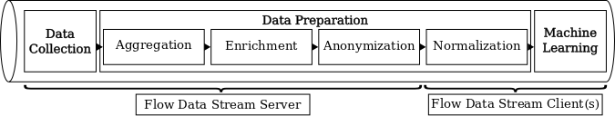

# Flow Data Streaming Server
Dependencies: Python version: 3.6+ (for used packages see [utils.py](utils.py))

## Desciption and Usage

The Flow Data Streaming Server implements the Data Collection stage and the Aggregation, Enrichment and Anonymization steps of the Data Preparation stage (see Flow Data Streaming Pipeline).
Upon the first [Flow Data Streaming Client](https://gitlab.cs.hs-fulda.de/flow-data-ml/cnsm2019/flow-data-streaming-client) connects, preprocessed **live** flow data is streamed.
Additionally, both raw and prepared flow data are stored as separate datasets, which can be **replayed** later.

The Flow Data Streaming Server can be started as follows:
* collect, prepare and stream live flow data: `python3 collector.py`
* replay a stored flow dataset (either raw or prepared data, see `FILE_NAME` in [constants.py](constants.py)): `python3 file_streamer.py`

### Parameters

While parameters for the flow collection/replaying and the client connection handler are specified in [constants.py](constants.py) (e.g., the data block size and address information), processing related parameters are defined in the header of [processor.py](processor.py) (e.g., for the aggregation, anonymization and feature filtering.)

#### Enrichment Details

A global prefixes and ASN database is constructed respectively downloaded automatically and stored in [/db/](./db/).
To enrich local flows with local prefixes and VLANs, add [/db/private_prefixes.csv](./db/private_prefixes.csv) and [/db/private_prefixes_vlans.csv](./db/private_prefixes_vlans.csv) (examples are given).

To increase the performance of the database lookup, install the [MaxMind C library for the MaxMind DB file format](https://github.com/maxmind/libmaxminddb).

This solution includes GeoLite2 data created by MaxMind, available from <a href="https://www.maxmind.com">https://www.maxmind.com</a>.

## Paper Reference
Flow-based Throughput Prediction using Deep Learning and Real-World Network Traffic, CNSM 2019